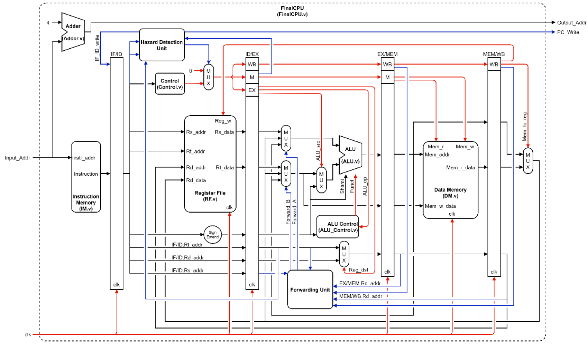

# Simplified MIPS CPU with 5-Stage Pipeline

This repository implements a simplified MIPS CPU featuring a classic five-stage pipeline. The design supports the following instructions:

* `addu`  — Unsigned addition
* `subu`  — Unsigned subtraction
* `sll`   — Logical left shift
* `or`    — Bitwise OR
* `addiu` — Add immediate unsigned
* `sw`    — Store word
* `lw`    — Load word
* `ori`   — Bitwise OR immediate



## Repository Structure

```
./
├── Part1/               # Homework submission (identical to Part3)
├── Part2/               # Homework submission (identical to Part3)
├── Part3/               # Core implementation and testbenches
│   ├── *.v              # Verilog source files for the CPU
│   ├── tb_FinalCPU.v    # Testbench that loads .asm programs
│   ├── testbench/       # Initial state data files
│   │   ├── DM.dat       # Data Memory (hex)
│   │   ├── IM.dat       # Instruction Memory (hex)
│   │   └── RF.dat       # Register File (hex)
│   ├── config.mk        # OpenROAD flow configuration
│   └── constraint.sdc   # Timing constraints for synthesis
├── assembler.py         # Python script: converts .asm to DM.dat
├── *.asm                # Sample MIPS assembly programs
├── report/              # LaTeX report detailing design and results
└── image/               # Images used in this README
```

## Prerequisites

Ensure you have the following tools installed:

* **Linux** (tested on Debian GNU/Linux 12)
* **Icarus Verilog** (`iverilog`) — Compile Verilog sources and run simulation
* **GTKWave** (`gtkwave`) — View waveforms generated by the testbench
* **Python 3** — Run the assembler script
* **OpenROAD** — Synthesize the CPU design

## Quick Start

### Running the Testbench

1. Change into one of the `Part*/` directories:

   ```bash
   cd Part3
   ```
2. Select the `.asm` file you wish to test by editing the `ASM` variable in `makefile`.
3. (Optional) Compile the Verilog sources:

   ```bash
   make
   ```
4. Run the simulation:

   ```bash
   make run
   ```
5. (Optional) View the waveform:

   ```bash
   make wave
   ```

### Synthesizing with OpenROAD

1. Enter a `Part*/` directory:

   ```bash
   cd Part3
   ```
2. Update the `OPENROAD` variable in `makefile` to point to your OpenROAD installation (e.g., `$OPEN_ROAD/flow/`).
3. Launch synthesis:

   ```bash
   make openroad
   ```
4. (Optional) Open the OpenROAD GUI to inspect the design:

   ```bash
   make openroad_gui
   ```